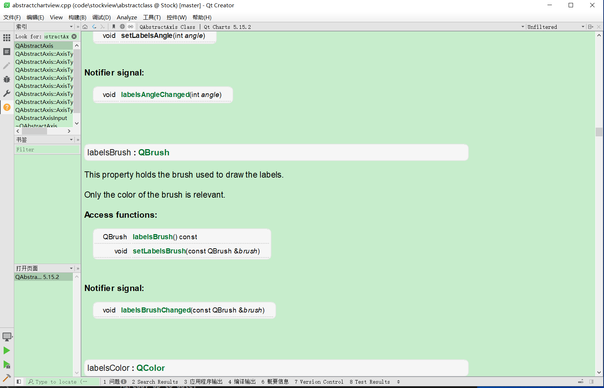
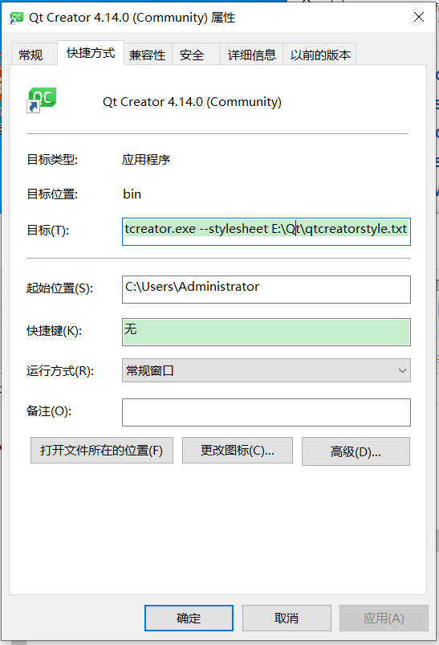

使用任何IDE的关注的点都是差不多的。

需要知道：
1. 编译器。它的地址、指定选项、build类型和目录等等。
2. 调试器。它的目录和选项。
3. 编译程序所需要的依赖项（C++中是头文件和库文件），C++通常由cmake指定，使用vs也是指定包含目录，依赖项目录，依赖项。
4. 文本编辑器的style,字体类型，背景颜色等等。
5. 代码风格，智能提示。
6. 文本编码规范，utf-8 还是？
7. 一些功能窗口的打开和关闭。
8. 快捷键。

以上，就可以基本熟练的使用一个IDE了。目前最常使用的IDE主要是vs、vscode和qtcreator。


使用qtcreator的时候，默认的帮助界面背景色是白色的，有点刺眼，为了可以看的舒服一点，把它改成绿色，下图效果。



QtCreator界面设置上没有提供改变帮助文档背景色的功能，但是可以通过命令行启动QtCreator，并同时传递参数，来设置这些。（使用Qt 的stylesheet,可以十分灵活的定制,包含字体设置等等。）

1. 在windows下使用powershell,设置永久别名。
```pwsh
PS C:\> $profile #查看profile的地址。如果没有，就新建一个。
PS C:\> New-Item -Type file -Force $profile
```
2. 编辑profile文件
```
function qt {
	 E:\Qt\Tools\QtCreator\bin\qtcreator.exe --stylesheet E:\Qt\qtcreatorstyle.txt
}
```
两个路径。一个是Qtcreator.exe的路径，一个是自定义的qss的路径。“qtcreatorstyle.txt”，完全是qss的语法。

```css
QPlainTextEdit
{
background-color: rgb(199, 237, 204);
}
QTextEdit
{
background-color: rgb(199, 237, 204);
}
```
3. 然后，重启powershell就可以键入 qt来启动QtCreator了。
4. 使用命令行还是十分方便的，如果依然想使用双击图标的方式打开QtCreator,就不需要设置上述的powershell了，直接设置QtCreator的快捷方式就可以了。


